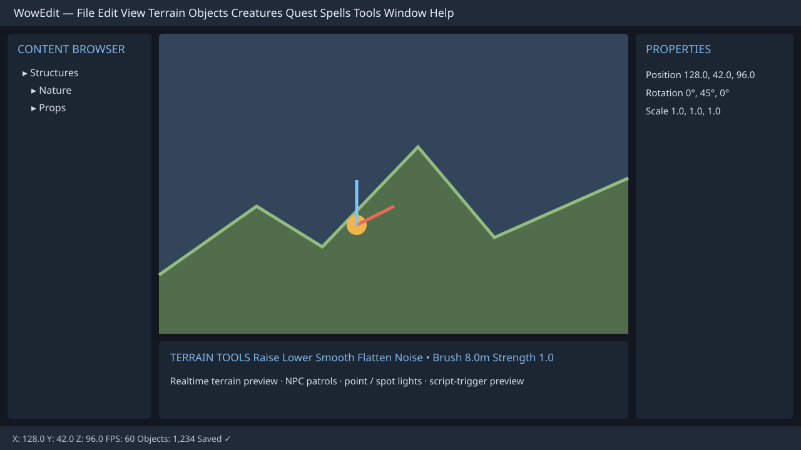

# TrinityCore Studio

A desktop world-building toolkit for browsing and editing World of Warcraft data in
**TrinityCore 3.3.5a (build 12340)** and **AzerothCore 3.3.5a** *world* databases. It combines record editors for
quests, items, creatures, gameobjects, scripting, conditions, loot, and reference tables
with a streamed **3D World Editor**. It resolves item / creature / gameobject / faction /
spell IDs to names and can either write changes **live** (transactional) or **export a
reviewable `.sql` file** - selectable per session.

Built with Dear ImGui (docking) + GLFW + Vulkan 1.4. Optional World of Warcraft client
data (MPQ/DBC) adds icons, zone maps, name resolution, and a Blizzard-styled theme.

## Editors

Pick an editor from the left rail. Each one shares the same shape: a searchable
**browser** on the left, a tabbed **editor** in the center, and a **validation**
panel + log across the bottom.

- **Quests** - the full quest picture across `quest_template` and every related
  table (addon, offer_reward, request_items, details, mail_sender, greeting,
  questgivers, conditions, all `*_locale`), plus an interactive **POI map** rendered
  over the real zone map (drag/add/delete points).
- **Items** - every `item_template` field across General, Flags, Requirements,
  Stats, Weapon/Armor, Spells, Sockets, Text & Set, Locales, with a live icon
  preview.
- **Creatures** - `creature_template` and its child tables (addon, movement,
  resistances, spells, equipment, locales) **plus** the systems keyed by the
  creature: **vendor** inventory, **trainer** spells, **loot** tables, and **world
  spawns** (edited in place). Faction resolves to a name via a FactionTemplate.dbc
  lookup.
- **GameObjects** - `gameobject_template` with a **type-aware Data tab**: the 24
  generic `Data0..23` columns are labeled per the selected type (a Door's `Data1` is
  a Lock id; a Chest's `Data1` is a loot id) with id-name pickers where a field
  references another table - plus addon, locales, quest items, loot, and spawns.
- **World Editor** - streams whole ADT maps from client data, renders terrain, doodads,
  WMOs, NPCs, GameObjects, transports, phases/events/pools, and provides a map overview,
  coordinate bookmarks, a searchable world outliner, precise transforms, rapid spawn brushes,
  formation links, non-destructive **terrain height sculpting**, a WoWEdit-style **Light Editor**
  (sun/ambient/fog plus point and spot lights), an **AI Behavior** panel (patrol/aggro/leash
  preview), visual **Script Triggers** (area, interaction, proximity, and timer events), right-click
  placement, deletion, undo/redo, spawn-instance forms, and an in-world **waypoint path editor**
  for NPC routes.

### World Editor workflow

The World Editor needs both client data (for terrain/models) and a project database (for
spawns). Choose a map in **World Browser**, fly or orbit around the streamed terrain, then
turn on **Edit**:

1. **Navigate a real map:** use **Locations** to enter exact TrinityCore X/Y/Z coordinates,
   click the interactive 64×64 map overview to stream/fly to a tile, or save reusable named
   bookmarks. The searchable **World Outliner** lists every NPC and GameObject spawn on the
   map—not only the ones currently within render range—and focusing a row streams it into view
   (or press **F** to frame the current selection).
2. **Move or place content:** click an NPC/GameObject/doodad to select it, then use the
   Move/Rotate/Scale gizmo, **Transform** panel (staged exact coordinates, yaw, copy/paste,
   nudging), or **Snap to ground**. Right-click terrain to add an NPC, GameObject, M2, or WMO;
   right-click an existing object for its context menu. DB spawns save transactionally on gizmo
   release; ADT placements are batched into the project's `edited-client` overlay.
3. **Dress a map quickly:** choose an NPC or GameObject template in **Spawn Palette**, arm the
   brush, and right-click terrain repeatedly. The palette retains yaw and has a per-session
   minimum-spacing guard; each placed spawn remains an ordinary undoable database instance. You
   can also load the selected NPC/GO template straight into the brush from **Transform**.
4. **Build formations:** select an NPC and use **Formation** to create a leader/self row, join a
   leader GUID, set distance/angle/group-AI/path-direction points, or remove membership. Purple
   world links make leader/member relationships visible and selectable in context.
5. **Sculpt terrain safely:** use **Terrain Sculpt** to arm a Raise, Lower, or Flatten height
   brush, then right-click the ground. Smooth radial strokes queue MCVT height changes and rebuilt
   MCNR normals across every intersected existing ADT tile. Pending strokes support Ctrl+Z/Ctrl+Y;
   **Save ADT edits** writes the project overlay and reloads streamed terrain.
6. **Light the scene:** open **Light Editor** for a WoWEdit-style point/spot-light list. Add a
   point or spot at the camera, or arm terrain placement and right-click the world. Select its
   colored marker to edit position, range, falloff, HDR color/intensity, and spot cone/direction.
   Sun/ambient presets and distance fog update the actual terrain, doodad, WMO, NPC, and GameObject
   preview immediately. **Save lighting** persists the map-scoped Studio profile; the nearest 16
   enabled local lights are evaluated in the live renderer.
7. **Run the live world:** **Realtime Preview** controls the continuous simulation clock for NPC
   routes/wander, transport paths, animated M2s, particles, liquid frames, and an optional animated
   day/night sun/fog cycle. Its **In-game view** hides editor helpers for a clean game-like render.
   Staged terrain strokes now deform the streamed terrain immediately; save ADT edits when you are
   ready to bake the exact MCVT/MCNR result into the edited-client overlay.
8. **Configure AI behavior:** select an NPC and open **AI Behavior**. Define Loop, Ping-pong, or
   One-shot patrol interpretation; create/edit its route in **Waypoint Path**; then set aggro and
   leash distances. Place the magenta AI target in the 3D world to preview acquisition, chase,
   leash return, and patrol resume in real time. Recognized schema fields such as
   `detection_range` and `leash_distance` can be saved to the server; unavailable core fields stay
   explicitly map-scoped Studio preview data rather than producing unsafe SQL guesses.
9. **Author script events:** use **Script Triggers** to add a circle/box area entry/exit trigger,
   click-on-NPC/GameObject interaction trigger, proximity trigger, or delayed/repeating timer. Place
   the cyan script player in the 3D world and use Click-to-interact to preview events in the live log.
   Every trigger records a custom hook, event id, and optional SmartAI action-list reference, plus
   an ordered delayed action sequence for hooks, SmartAI lists, spell casts, text, or GameObject
   state previews. Copy a trigger manifest JSON for a custom server hook; Studio saves this map-scoped
   metadata safely when a stock 3.3.5 schema has no native arbitrary-volume table.
10. **Edit an NPC route:** select an NPC and open **Waypoint Path**. The panel identifies whether
   its route comes from the creature template (shared) or its `creature_addon` row (local). Use
   **Make local copy** before changing a shared route when the change is map/spawn-specific;
   creating that local addon carries over the template's visual addon settings so mounted/
   aura-equipped NPCs keep their appearance.
11. **Author paths in 3D:** click blue numbered route markers to select a point. Add a point at
   the NPC home, arm **Place on terrain** and right-click ground to insert a point, or arm
   **Move selected on terrain** to reposition one. The route overlay, loop line, delays,
   orientation, walk/run mode, events, actions, chances, and `wpguid` all preview and edit in
   place. Route-table changes have local Ctrl+Z/Ctrl+Y before Save.
12. **Save deliberately:** route edits are an unsaved live preview until **Save route**. Existing
   `waypoint_data` rows are updated transactionally rather than replaced, so project-specific
   columns survive point moves/reordering. A spawn addon row takes precedence over template addon
   data in TrinityCore; clearing its `path_id` keeps its other addon fields and intentionally
   leaves that spawn without a route.
13. **Verify server appearance:** select an NPC and inspect **NPC Instance → World appearance**.
   The renderer resolves the server's `CreatureDisplayInfo` id in this order: persistent spawn
   `displayid`/`modelid`, modern AzerothCore `creature_template_model.CreatureDisplayID`, then
   legacy TrinityCore `creature_template.modelid1..4`. It applies the selected
   `DisplayScale` plus the client DBC display scale, and switches to
   `game_event_model_equip.modelid` while that event is selected in the World Editor. Weighted
   template rows are sampled deterministically per spawn for a stable offline preview; an arbitrary
   live-server random roll is not persisted by the world DB. The panel shows the exact display id
   and source currently rendered; on schemas with a per-spawn
   `modelid`/`displayid` column, **Server display ID** gives one spawn an explicit persistent
   override. Script-only runtime `SetDisplayId` changes are not
   stored in a world database, so they need a persistent spawn/event row to be available offline.

### Shared features

- **World-editor command menus**: when World Editor is active, the main menu exposes direct
  **Terrain**, **Objects**, **Creatures**, **Quest**, **Spells**, **Tools**, and **Window** commands.
  They arm the existing terrain/gizmo/preview-player workflows, persist pending ADT edits through the
  same atomic path as the viewport toolbar, focus the appropriate dock panel, or switch to the
  real Quest/Spell editor rather than presenting dead menu entries. **Spells → Spell Effect Previewer**
  opens an in-world timing tool that reads available `Spell.dbc` cast/range/cooldown/mana/speed/
  SpellVisual/effect fields, supports search, play/pause/stop/loop/scrub, target/weather choices,
  clipboard manifests, and a camera-aware cast/projectile/impact fallback. Script Trigger `CastSpell`
  actions invoke the same preview; it remains Studio visualization until matching SmartAI or custom
  server wiring executes actual gameplay.
- **Refreshed workspace UI**: a project-aware command bar, grouped/searchable editor navigation,
  Ctrl+P command palette, responsive project cards, and a three-column navigation/canvas/inspector
  default layout. The World Editor automatically places catalogs left, live map center, inspectors
  right, and route/terrain tools below; use **View → Reset Layout** at any time.
- Browse & search by ID or name, with type/quality/rank filters, server-side sort,
  and paging.
- Create (blank or from an **archetype template**), **Clone**, **Delete**, **Revert**,
  and full **Undo/Redo**.
- Live **validation** with severity levels; click an issue to jump to the field.
- Tools per editor: **Where-Used** (reverse references), **New-from-Template**, and
  column-level **Batch-Edit** across the current browser list.
- Two write modes: **Live** (direct, transactional, with a confirmation) or **SQL
  Export** (reads live, writes an ordered `.sql` you can review/commit to git).
  **Preview SQL** shows exactly what a save will run.
- Optional SOAP `.reload` after a live save (if a worldserver account is configured).
- Saved connection profiles (`config/connections.json`; passwords stored only if you
  opt in) and per-editor preferences.

### Client data (optional)

Point the app at a WoW 3.3.5a `Data` folder (MPQ archives) to unlock item/spell
**icons**, quest **POI zone maps**, the streamed 3D **World Editor** (ADT terrain, M2s,
WMOs, and NPC/GameObject models), name resolution for factions / spells / areas / skills /
titles / faction templates, and the **Blizzard parchment theme** + UI font. A core server's
extracted `Data` folder is not a substitute for a full WoW client Data folder: Studio now shows
selectable NPC map markers plus model diagnostics when creature M2/DBC files are missing. Record
editors still work without client data - you just get IDs instead of names and the dark theme.

### Core compatibility: TrinityCore + AzerothCore

Projects now carry a **Core** profile: Auto-detect, TrinityCore, or AzerothCore. Auto-detect
probes a live database before editor modules load. It recognizes the current AzerothCore
`creature.id1` / `gameobject.id1` spawn layout, its `bytes1` / `bytes2` creature-addon
layout, current `creature_template_model` display rows, and reduced `waypoint_data` variants;
TrinityCore layouts continue to use `id`, `modelid1..4`, and expanded addon fields. World Editor
spawn placement, outliner, paths, formation data, server display rendering, and creature/gameobject
associated-spawn panels adapt their entry-column and optional-field SQL at runtime.

For an AzerothCore project, optionally set **Core root** in the project form. Studio detects
common `env/dist/etc`, `env/dist/configs`, and Windows build `configs` layouts, can import
`WorldDatabaseInfo` from `worldserver.conf`, and still keeps your **WoW client `Data` folder**
separate from the server's extracted `Data` directory. Core-specific columns are schema-filtered
on save, so one project file can safely target either core.

The universal **DB Editor** uses `SHOW TABLES` / `SHOW COLUMNS` metadata for every
AzerothCore table by default—rather than assuming a curated TrinityCore column list. That means
module-added and revision-specific tables, composite keys, optional columns, and current AzerothCore
layouts are browsed and saved against the schema actually connected to Studio.

## Build

Requirements: **Visual Studio 2026** (MSVC v145 toolset) and **git**. All other
dependencies (Dear ImGui, GLFW, the MySQL C client, nlohmann/json, StormLib,
premake5) are **vendored** in `third_party/` and `tools/` - nothing else to install.

```powershell
.\build.ps1 Debug      # or: .\build.ps1 Release
```

If PowerShell blocks the unsigned local helper, use a process-only bypass (it resets when
that terminal closes):

```powershell
Set-ExecutionPolicy -Scope Process -ExecutionPolicy Bypass -Force
.\build.ps1 Release
```

This runs `tools\premake5.exe vs2026` to generate `build\TrinityCoreStudio.slnx`, then
builds it. Output: `bin\Debug\TrinityCoreStudio.exe`. You can also open
`build\TrinityCoreStudio.slnx` in Visual Studio 2026 directly.

## Run

```powershell
.\bin\Debug\TrinityCoreStudio.exe
```

In the app: open the **Connection** panel, enter your world DB host/user/password/db,
pick **Live** or **SQL Export** mode, and Connect. Choose an editor from the rail, use
the **Browser** to find a record, edit it in the tabbed editor, and **Save** (live) or
export to `.sql`. On first run you can point it at your client `Data` folder for icons,
maps, and names.

## Notes / status

- Targets the 3.3.5a build-12340 world schema shipped with this TrinityCore tree.
  Works with **MySQL 8.0** (reserved-word columns like `rank` are quoted).
- Schema-adaptive writes: only columns the live DB actually has are written, so minor
  TrinityCore schema drift is tolerated. `VerifiedBuild` is written as `0`; empty text
  is written as `''` (not SQL `NULL`).
- Editing shared child data (loot templates, trainers) affects every record that
  references it; spawn edits apply per-`guid`.
- Windows-only for now (GLFW + Vulkan backend, Win32 surface; the code is otherwise
  portable). Requires the LunarG Vulkan SDK to build and a Vulkan-1.4 driver to run.

---

## WowEdit portable editor core



The repository now also contains **`WowEdit/`**, a portable, production-oriented
editor core that formalizes the World Editor into an MVC-friendly architecture.
It intentionally reuses the project's proven **C++17 + Vulkan + Dear ImGui**
direction:

- **C++17** is the right fit here because the existing M2/WMO/ADT readers,
  Vulkan renderer, MySQL integration, and desktop host are C++ and can share
  memory without a C ABI or managed/native bridge.
- **Vulkan** remains the production graphics API. It matches the existing
  renderer, provides explicit resource lifetime and instancing/culling paths,
  and is available on Windows/Linux/macOS via MoltenVK. The `WowEdit` document
  and UI controllers stay graphics-backend-neutral for testing and plugins.
- **Dear ImGui** remains the primary desktop UI framework. Docking, immediate
  editing controls, and the existing Studio shell make it ideal for a dense
  world-authoring workstation. `WowEdit/ui` is a presentation-model layer, so
  a future Qt shell can render the same menu/panel controllers without moving
  terrain or database logic into widgets.

`WowEdit` is not a replacement for proprietary Blizzard tools or client assets.
It is an open-source authoring layer that implements documented, editor-facing
workflows using original code and freely distributable procedural starter assets.
The existing **TrinityCore Studio** host is the live 3D, TrinityCore 3.3.5a, and
AzerothCore 3.3.5a integration target; the portable core makes those workflows
buildable/testable on Windows, Linux, and macOS.

### What is implemented in this foundation

- Explicit `ICommand` / `CommandManager` undo-redo with nested macros and the
  required terrain, texture, doodad, creature, chunk, vertex-color, and generic
  property command types.
- Thread-safe event bus for terrain/object/creature/file/view/tool/system events.
- Heightmap sculpting (raise, lower, Laplacian smooth, flatten, deterministic
  noise), named falloff curves, tablet-pressure input, terrain ramp/stamp,
  thermal erosion, and hydraulic erosion.
- Four-channel splatmaps with 13-zone-texture registration, paint, flood fill,
  smudge, clone stamp, sampling, height blending, and vertex color painting.
- Liquid cell, animated-water state, chunk LOD/collision mesh generation, and
  native `.wowedit` JSON manifests with atomic binary height/splat attachments.
- Command-backed doodad placement/selection/transforms/scatter/grouping,
  creature spawn configuration, waypoint visualization, patrol/chase/leash
  simulation, spell-effect timeline preview, chunk copy/paste transforms,
  plugin, scripting, import/export, profiling, and version-control facades.
- A complete menu model for all File, Edit, View, Terrain, Objects, Creatures,
  Quest, Spells, Tools, Window, and Help workflows documented below; the
  existing ImGui Studio UI continues to expose its current live-core panels.
- Original starter textures, OBJ test models, six-face sky colors, icons, theme,
  presets, test map manifest, GLSL 4.5 shader sources, unit tests, integration
  test, and a 100k-object benchmark target.

### Build the portable core (Windows, Linux, macOS)

The main Studio executable is currently generated by `premake5.lua` as described
above. The portable `WowEdit` core has a standard CMake build that does not need
Vulkan or a game client just to run document/tool tests:

```bash
cmake -S . -B build-cmake -DWOWEDIT_BUILD_TESTS=ON
cmake --build build-cmake --config Release
ctest --test-dir build-cmake --output-on-failure -C Release
```

On Windows, run those commands from a Visual Studio Developer PowerShell or use
Visual Studio's **Open a local folder** CMake support. On macOS, install a C++17
compiler and CMake (MoltenVK is only needed when adding a Vulkan presentation
host). On Linux, install a C++17 compiler, CMake, and pthread development
packages. The portable core vendors GLM, nlohmann/json, and the small zlib subset already
carried by StormLib under `third_party`; no package-manager dependency is required.

To build the current Windows Vulkan Studio host, use the documented process-only
PowerShell policy bypass — no machine-wide execution-policy change is required:

```powershell
Set-ExecutionPolicy -Scope Process -ExecutionPolicy Bypass -Force
.\build.ps1 Release
```

Expected host output: `bin\Release\TrinityCoreStudio.exe`.

### Five-minute WowEdit quick start

1. Build `WowEditDemo` with CMake and run:
   `./WowEditDemo samples/MyFirstZone.wowedit`.
2. Open the generated project in a compatible WowEdit host. The default layout
   presents Content Browser, central Viewport, Properties, Terrain Tools,
   Texture Palette, and Hierarchy.
3. Choose **Terrain → Terrain Tools → Raise/Lower**, set brush radius/strength,
   then sculpt. Every stroke is a command, so `Ctrl+Z` / `Ctrl+Y` is safe.
4. Assign grass/dirt/rock/sand/snow to the four active texture channels and use
   **Texture → Paint**, Flood Fill, Smudge, Clone, or Vertex Paint.
5. Drag a procedural starter object from Content Browser, use Q/W/E/R transform
   modes with grid/angle snapping, and save. Add a creature spawner, Ctrl-click
   waypoints, then preview Patrol/Aggro/Leash in the World Editor.

### Keyboard shortcuts

| Shortcut | Action |
| --- | --- |
| `Ctrl+S`, `Ctrl+Shift+S` | Save / Save As |
| `Ctrl+Z`, `Ctrl+Y` | Undo / Redo |
| `Ctrl+O`, `Ctrl+Q` | Open / Quit |
| `Q`, `W`, `E`, `R` | Select, Move, Rotate, Scale |
| `T`, `S`, `L`, `N` | Raise/Lower, Smooth, Flatten, Noise |
| `P`, `V`, `I` | Paint Texture, Vertex Paint, Eyedropper |
| `G`, `D`, `C` | Grid, Doodads, Creatures visibility |
| `F`, `Home`, `F11` | Focus, Reset Camera, Fullscreen |
| `Ctrl+P` | TrinityCore Studio command palette |

### Contributing

1. Create changes on the active Arena branch; keep the data/renderer/editor
   layering intact.
2. Add a focused test under `tests/unit_tests` or `tests/integration_tests` for
   portable-core behavior. Run the CMake/CTest flow (or the strict C++17 syntax
   checks when CMake is unavailable).
3. Do not commit copyrighted WoW client data, MPQs, DBCs, or paid assets.
   Procedural/test assets belong in `resources/default_assets`.
4. Keep database writes schema-aware for both TrinityCore and AzerothCore. A
   Studio preview profile must never be described as a stock core capability.

The project is distributed under the [MIT License](LICENSE). Credits include
GLFW, Vulkan/volk/VMA, Dear ImGui, ImGuizmo, GLM, nlohmann/json, StormLib,
TrinityCore, AzerothCore, and the wider WoW modding documentation community.
